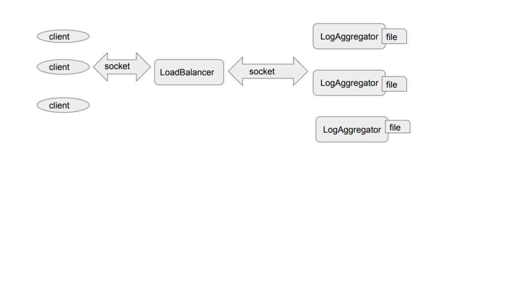

# Gandalf
Gandalf is a distributed and highly available log aggregator service.

# Architecture
  

# Build
`mvn clean package` will generate a shaded jar under `buildmodule/target`

# Installation
* Java should be already installed in all the VMs.
* Copy the build jar into all the VMs.

## Run services
 <h4>Starting LoadBalancer</h4>
`java -cp gandalf-build-0.0.1-SNAPSHOT bharati.binita.gandalf.loadbalancer.Main &`

<h4>Starting LogAggregator</h4>
`java -cp gandalf-build-0.0.1-SNAPSHOT bharati.binita.gandalf.aggregator.Main &`

#Test
A test client has been provided with this project.
`java -cp aggregator-client-0.0.1-SNAPSHOT bharati.binita.gandalf.aggregator.client.AggregatorClient`

